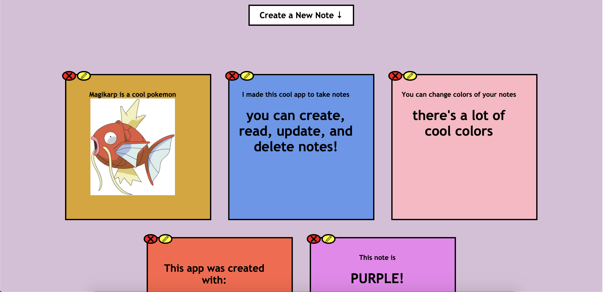
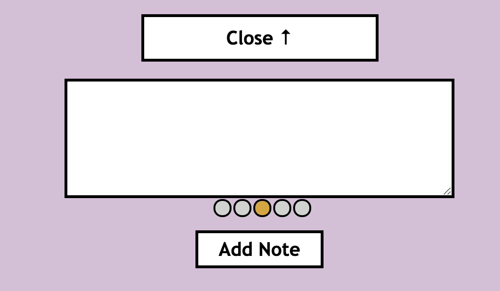

# Note-App
This is a note taking app where you can create, read, update and delete notes!

Run "json-server --watch db.json" to run the JSON server. Then you will be able to have full functionality of the app.

